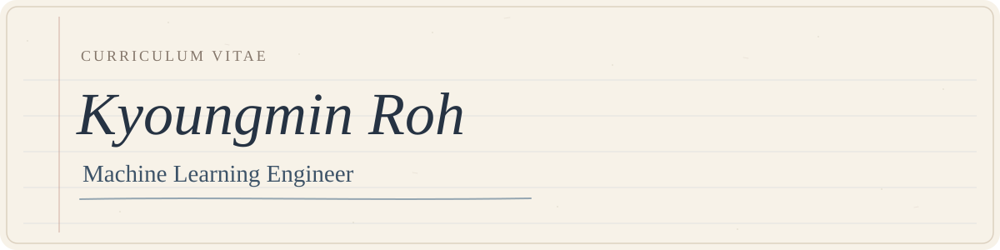

  

  
  
  
  
  

  
  
  
  
  
  
  

## About Me
I build machine learning models and study the systems that make them trustworthy. 
My work spans Android malware detection under concept drift, post-quantum cryptography in TEEs, and confidential computing for software-defined vehicles. 
Research intern at Seoul National University; first-author publications in CMES and ACM SAC.

## Education

### Dankook University
**Bachelor of Engineering in Industrial Security** · Yongin, Republic of Korea · Mar 2021 – Expected Feb 2027

- **GPA:** 3.20/4.50 (grade percentage: 87/100)
- **Undergraduate thesis:** “Qrust: AI-Powered QR Phishing Detection and Secure QR Generation.” [Project repositories](https://github.com/dku-capstone).
- **Selected coursework:** Artificial Intelligence and Information Security, Digital Forensics, Reverse Engineering

## Professional experience

### Seoul National University | [Security Optimization Research Lab](https://sor.snu.ac.kr/)
**Research Intern** · Seoul, Republic of Korea · Jun 2026 – Present  
Supervisor: Prof. Yunheung Paek; Mentor: Martin Kayondo

- Designed a **Zephyr-in-Realm shim architecture** for virtualized automotive ECUs, with Automotive Grade Linux as the IVI domain under Arm CCA.
- Modeled **untrusted-hypervisor, shared-memory, and temporal trust risks** in virtualized ECUs and defined security requirements for an in-progress manuscript.
- Reviewed **robot foundation model and VLA pipelines**, mapping attack surfaces across multimodal inputs, reasoning, tool interfaces, and closed-loop control.

### Dankook University | [Computer Security and Operating Systems Lab](https://securesw.dankook.ac.kr/index.html)
**Undergraduate Research Assistant** · Yongin, Republic of Korea · Mar 2025 – Jul 2026  
Supervisor: Prof. Seong-je Cho

- Developed **Android malware detection pipelines** using API co-occurrence graphs, Louvain/Leiden communities, mixture models, and adaptive thresholds; evaluated generalization across temporally separated datasets.
- Built **cluster-based explanations and behavioral evidence** for model decisions. Research outputs include first-author CMES and ACM SAC papers, a patent application, and Outstanding Paper awards.
- Implemented **split ML-KEM on TrustZone-A**, keeping secret-dependent operations in the Secure World and offloading public computation. Evaluated trusted-code size, secure-monitor-call overhead, and latency; received the KCC 2026 Distinguished Paper Award and a research-paper contest 1st Place Award.

### Indiana University Bloomington | [CPS Security Lab](https://kimhyungsub.github.io/)
**Research Intern** · Bloomington, IN, USA (Remote) · Oct 2025 – Jan 2026  
Supervisor: Prof. Hyungsub Kim

- Collected and normalized **open-source CPS vulnerability reports** from OSV, GitHub Issues, and security forums.
- Classified reports by **affected component, failure mode, attack surface, and security impact**.

### KATUSA (Korean Augmentation to the U.S. Army)
**U.S. Eighth Army, 35th Air Defense Artillery Brigade, 2-1 ADA Battalion** · Camp Carroll, Republic of Korea · Aug 2023 – Feb 2025

- Served as an **artillery supply soldier, environmental officer, and interpreter**, coordinating logistics and bilingual communication.
- Member of the winning **Best Warrior Squad**; received the Army Commendation Medal, Best KATUSA Award, and U.S. and ROK Army service recognition.

## Publications

† Co-first authorship.

### International journal article

1. **[SCAN: Structural Clustering with Adaptive Thresholds for Intelligent and Robust Android Malware Detection under Concept Drift](https://www.sciencedirect.com/org/science/article/pii/S1526149226001244)**  
   **Kyoungmin Roh**, Seungmin Lee, Seong-je Cho, Youngsup Hwang, and Dongjae Kim.  
   *Computer Modeling in Engineering & Sciences (CMES)*, Apr 2026.  
    

### International conference papers

1. **[ALARM: Android Malware Detection with Leiden API Communities and Robust Mixture of Experts](https://dl.acm.org/doi/10.1145/3748522.3779797)**  
   **Kyoungmin Roh**, Seungmin Lee, Seong-je Cho, and Youngsup Hwang.  
   *Proceedings of the 41st ACM/SIGAPP Symposium on Applied Computing (SAC 2026)*, Thessaloniki, Greece, Mar 2026.  
    
2. **C-STAR: Cost-Aware Adaptive Learning under Concept Drift for Android Malware Detection**  
   Nahee Kwon, **Kyoungmin Roh**, Youngsup Hwang, Seong-je Cho, and Boojoong Kang.  
   *Proceedings of the 23rd International Conference on Security and Cryptography (SECRYPT 2026)*, Porto, Portugal, Jul 2026.  

### Domestic journal article

1. **[Concept Drift-Resilient Android Malware Detection via API Co-occurrence Graphs and Louvain Communities](https://www.dbpia.co.kr/journal/articleDetail?nodeId=NODE12586205)**  
   **Kyoungmin Roh** and Seong-je Cho.  
   *KIISE Transactions on Computing Practices*, Jan 2026. Invited article.  

### Domestic conference and workshop papers

1. **A Lightweight ML-KEM Architecture via Secret-Dependency-Based Partitioning for Embedded TrustZone-A Systems**  
   **Kyoungmin Roh**†, Nahee Kwon†, Suhyeon Park, and Seong-je Cho.  
   *Korea Computer Congress (KCC 2026)*, Jeju, Republic of Korea, Jun 2026.  
   
2. **SCA: A Security Descriptor-Guided Logit Calibration Module for Concept Drift Adaptation in Android Malware Detection**  
   Nahee Kwon, **Kyoungmin Roh**, Suhyeon Park, and Seong-je Cho.  
   *Korea Computer Congress (KCC 2026)*, Jeju, Republic of Korea, Jun 2026.  
3. **[Drift-Aware Security Module Based on Louvain Communities for Retraining-Free Android Malware Detection](https://www.dbpia.co.kr/journal/articleDetail?nodeId=NODE12577588)**  
   **Kyoungmin Roh**, Suhyeon Park, and Seong-je Cho.  
   *Korea Software Congress (KSC 2025)*, Yeosu, Republic of Korea, Dec 2025.  
   
4. **[Android Malware Detection Using Co-occurrence Graphs of APIs and Louvain Method for Community Detection](https://github.com/rohkyoungmin/Research-Papers/blob/main/WDSC/API%EB%93%A4%EC%9D%98%20%EB%8F%99%EC%8B%9C%20%EC%B6%9C%ED%98%84%20%EA%B7%B8%EB%9E%98%ED%94%84%EC%99%80%20%EC%BB%A4%EB%AE%A4%EB%8B%88%ED%8B%B0%20%ED%83%90%EC%A7%80%EC%9A%A9%20Louvain%20%EB%B0%A9%EB%B2%95%EC%9D%84%20%EC%9D%B4%EC%9A%A9%ED%95%9C%20%EC%95%88%EB%93%9C%EB%A1%9C%EC%9D%B4%EB%93%9C%20%EC%95%85%EC%84%B1%20%EC%95%B1%20%ED%83%90%EC%A7%80/WDSC2025_paper_6.pdf)**  
   **Kyoungmin Roh**, Seungmin Lee, Yudam Kim, Seokhyun Ahn, and Seong-je Cho.  
   *Workshop on Dependable and Secure Computing (WDSC 2025)*, Jeju, Republic of Korea, Aug 2025.  
   
5. **[Classifying File Fragment Types for IVI System Forensics](https://github.com/rohkyoungmin/Research-Papers/blob/main/WDSC/IVI%20%EC%8B%9C%EC%8A%A4%ED%85%9C%20%ED%8F%AC%EB%A0%8C%EC%8B%9D%EC%9D%84%20%EC%9C%84%ED%95%9C%20%ED%8C%8C%EC%9D%BC%20%ED%8C%8C%ED%8E%B8%20%EC%9C%A0%ED%98%95%20%EB%B6%84%EB%A5%98/Classifying%20File%20Fragment%20Types%20for%20IVI%20System%20Forensics.pdf)**  
   Seungmin Lee, **Kyoungmin Roh**, Jiheon Jung, Suhyeon Park, and Seong-je Cho.  
   *Workshop on Dependable and Secure Computing (WDSC 2025)*, Jeju, Republic of Korea, Aug 2025.  

### Additional research publication

1. **[A Lightweight Secret-Isolated Post-Quantum Cryptographic Architecture for ARM TrustZone](https://github.com/rohkyoungmin/Research-Papers/blob/main/Cyber%20Security%20Contest%202025/ARM%20TrustZone%20%EA%B8%B0%EB%B0%98%20%EA%B2%BD%EB%9F%89%20%EB%B9%84%EB%B0%80%20%EB%B6%84%EB%A6%AC%ED%98%95%20%EC%96%91%EC%9E%90%EB%82%B4%EC%84%B1%20%EC%95%94%ED%98%B8%20%EC%95%84%ED%82%A4%ED%85%8D%EC%B2%98.pdf)**  
   **Kyoungmin Roh**, Nahee Kwon, Bogyeom Kim, and Subin Jeon.  
   *Cyber Security Contest*, Department of Cybersecurity, Dankook University, Dec 2025.  
   

### Manuscripts and ongoing writing

1. **Louvain Community Structure Analysis-Based Auto-XAI Framework for Android Malware Detection**  
   Nahee Kwon, **Kyoungmin Roh**, and Seong-je Cho.  
   Submitted to the *Journal of KIISE*. Invited submission.  
2. **Kyoungmin Roh**, Seong-je Cho, Martin Kayondo, and Jiwon Seo. Manuscript on confidential computing for software-defined vehicles. In preparation.

## Projects

### Featured projects

| Project | Overview | Link |
| --- | --- | --- |
| **SCAN** | Android malware detection using structural clustering and adaptive thresholds (CMES 2026).   |  |
| **ALARM** | Android malware detection using Leiden communities and mixture of experts (ACM SAC 2026).   |  |
| **MLKEM-Split** | ML-KEM partitioning prototype with information-flow control and TEE secret isolation.   |  |
| **AISECApp** | C/C++ vulnerability analysis agents with NVD CVE mapping and deterministic evidence verification.   |  |
| **lidar_car_project** | ROS 2 robot car with web control, live LiDAR scans, and obstacle detection.   |  |

<strong>More projects and tools (10)</strong>

### Research & security

| Project | Overview | Link |
| --- | --- | --- |
| **ACSAC_ARTIFACT** | Experiment code and results for semantic cluster-guided Android malware drift detection.   |  |
| **Post-Quantum-Signature-System** | Python prototype combining Lamport one-time signatures and Merkle trees.   |  |
| **api-sequence-extractor-gui** | Method-level Android API sequence extraction with Python and an Electron GUI.   |  |

### Applications

| Project | Overview | Link |
| --- | --- | --- |
| **QRust-AI** | Qrust model training, URL feature engineering, and Flask API.   |  |
| **QRust-FE** | Flutter frontend for the Qrust secure-QR project.   |  |
| **dku_startup_hackathon** | Ttobak Ttobak: AI-assisted pronunciation training and visual feedback prototype.   |  |
| **smart-greenhouse-disease-detector** | EfficientNetB0-based crop leaf disease classification.   |  |

### Utilities

| Project | Overview | Link |
| --- | --- | --- |
| **web_crawling** | Product review collection with sentiment and emotion keyword classification.   |  |
| **image-expander** | Tkinter and Pillow GUI for adding transparent padding to PNG images.   |  |
| **ico_converter** | CLI for converting PNG and SVG images into multi-resolution ICO files.   |  |

## Patent
1. **Kyoungmin Roh**, Seungmin Lee, Seong-je Cho, and Yoonho Choi. "A Malware Detection Model Combining Clustering and Supervised Learning Models," Korean Patent Application No. 10-2025-0098855. Filed.

## Honors and awards

### Research, paper, and project awards

| Date | Award and recognition |
| --- | --- |
| Jun 2026 | **KCC 2026 Distinguished Paper Award** Korean Institute of Information Scientists and Engineers · Honored the paper on ML-KEM partitioning for embedded TrustZone-A |
| Dec 2025 | **Cyber Security Contest, First Place** Dankook University, Department of Cybersecurity · Won the research-paper track for split ML-KEM on TrustZone-A |
| Dec 2025 | **KSC 2025 Outstanding Paper Award** Korean Institute of Information Scientists and Engineers · Honored retraining-free Android malware detection with Louvain communities |
| Dec 2025 | **Capstone Festival Audience Choice Award** Dankook University, National Center of Excellence in Software · Audience-selected award for the Qrust secure-QR phishing detector |
| Sep 2025 | **Dankook Startup Hackathon, 3rd Place** Dankook University, National Center of Excellence in Software · Third place for the accessibility-focused DDobak speech-therapy prototype |
| Aug 2025 | **WDSC 2025 Outstanding Paper Award** Korean Institute of Information Scientists and Engineers · Honored Android malware detection using API co-occurrence communities |
| Sep 2023 | **Cryptography Application Competition, 1st Place** Dankook University, Department of Cybersecurity · First place for a Lamport OTS and Merkle-tree signature prototype |

### Military and leadership honors

| Date | Award and recognition |
| --- | --- |
| Feb 2025 | **Certificate of Appreciation** United States Army Garrison Daegu · Recognized contributions to U.S. Army operations in Korea |
| Feb 2025 | **Republic of Korea Army Soldier Award** Republic of Korea Army · Recognized exemplary service during the KATUSA assignment |
| Dec 2024 | **Army Commendation Medal (ARCOM)** United States Department of the Army · Awarded for meritorious service with the 35th Air Defense Artillery Brigade |
| Oct 2024 | **Best KATUSA Award** Eighth U.S. Army ROK Army Support Group · Recognized outstanding duty performance as a KATUSA |

## Scholarships

| Date | Scholarship and basis |
| --- | --- |
| Aug 2026 | **Danwoo Academic Merit Scholarship** Dankook University · Academic performance ranking in the top 6% of the department |
| Aug 2026 | **Academic Research Scholarship** Dankook University, National Center of Excellence in Software · Sustained undergraduate research and scholarly output |
| Dec 2025 | **Specialized Project Scholarship** Dankook University, Department of Cybersecurity · High performance in a department-designated security project |
| Dec 2025 | **Academic Research Scholarship** Dankook University, National Center of Excellence in Software · Undergraduate research performance and publication activity |
| Dec 2022 | **Special Academic Merit Scholarship** Dankook University, Department of Industrial Security · Strong academic performance in the major |
| Dec 2022 | **Specialized Project Scholarship** Dankook University, Department of Industrial Security · High performance in a department-designated project |
| Mar 2021 | **Admission Scholarship** Dankook University, National Program of Excellence in Software · Entrance scholarship through the university's software-excellence program |

## Test scores

**TOEFL iBT:** Overall **5.0/6.0 (100/120)** · R 5.5 / L 5.0 / W 5.5 / S 4.0 · CEFR C1

---

<a href="#top">Back to top</a> &nbsp;|&nbsp; <a href="mailto:imsie1@dankook.ac.kr">Contact</a>

